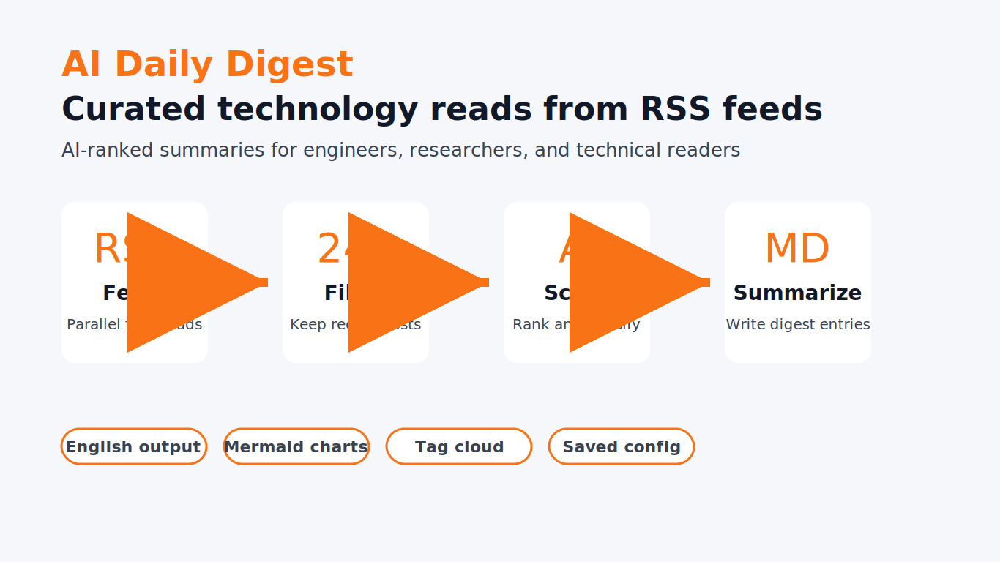

# AI Daily Digest

Fetch recent posts from a curated list of Hacker News-popular technology blogs plus selected AI and engineering sources, score them with an AI model, and generate a structured daily Markdown digest.



The source list is based on the [Hacker News Popularity Contest 2025](https://refactoringenglish.com/tools/hn-popularity/) and includes sites such as Simon Willison, Paul Graham, Overreacted, Gwern, Krebs on Security, and Daring Fireball.

## Usage

Ask your coding agent to run the `ai-daily-digest` skill. The agent will guide you through the configuration:

| Setting | Options | Default |
|---|---|---|
| Time range | 24h / 48h / 72h / 7d | 48h |
| Selected articles | 10 / 15 / 25 | 25 |
| Output language | English | English |
| Anthropic API key | Manual input, saved for later | Required |

Configuration is saved to `~/.hn-daily-digest/config.json` for reuse.

### Direct CLI

```bash
export ANTHROPIC_API_KEY="your-key"
export ANTHROPIC_MODEL="claude-opus-4-6"
export ANTHROPIC_EFFORT="xhigh"
export GEMINI_API_KEY="your-gemini-key"
export OPENAI_API_KEY="your-openai-compatible-key"
export OPENAI_API_BASE="https://api.deepseek.com/v1"
export OPENAI_MODEL="deepseek-chat"

npx -y bun scripts/digest.ts --hours 48 --top-n 25 --lang en --output ./digest.md
```

## Pipeline

```text
RSS fetch -> time filter -> AI scoring and classification -> AI summaries -> trend summary
```

1. RSS fetching: concurrently fetches all configured feeds with a 15 second timeout.
2. Time filtering: keeps posts inside the selected time window.
3. AI scoring: scores relevance, quality, and timeliness from 1 to 10, then assigns a category and keywords.
4. AI summaries: generates structured article summaries and recommendation reasons.
5. Trend summary: writes a concise overview of the main themes in the selected articles.

## Output

The generated Markdown digest includes:

| Section | Contents |
|---|---|
| Highlights | A short trend summary across the selected articles |
| Top reads | A deeper showcase of the top three articles |
| Data overview | Feed/article counts, Mermaid charts, plain-text keyword chart, and tag cloud |
| Category lists | Articles grouped by AI/ML, security, engineering, tools/open source, opinion, and other |

## Categories

| Category | Coverage |
|---|---|
| AI / ML | Artificial intelligence, machine learning, LLMs, and deep learning |
| Security | Security, privacy, vulnerabilities, and cryptography |
| Engineering | Software engineering, architecture, programming languages, and systems |
| Tools / Open Source | Developer tools, open-source projects, libraries, and framework releases |
| Opinion | Industry analysis, personal essays, career topics, and culture |
| Other | Posts that do not fit the categories above |

## Requirements

- [Bun](https://bun.sh), available through `npx -y bun`
- At least one AI API key:
  - `ANTHROPIC_API_KEY` for the primary provider
  - optional `GEMINI_API_KEY` fallback
  - optional `OPENAI_API_KEY` fallback with `OPENAI_API_BASE` / `OPENAI_MODEL`
- Network access for RSS feeds and AI API calls

## AI Providers

The script selects providers in this order:

1. `ANTHROPIC_API_KEY`: primary provider, default `ANTHROPIC_MODEL=claude-opus-4-6` and `ANTHROPIC_EFFORT=xhigh`
2. `GEMINI_API_KEY`: fallback provider
3. `OPENAI_API_KEY`: OpenAI-compatible fallback provider

| Provider | API endpoint | Key variable |
|---|---|---|
| Anthropic | `https://api.anthropic.com/v1/messages` | `ANTHROPIC_API_KEY` |
| Gemini | `https://generativelanguage.googleapis.com/v1beta/models/gemini-2.0-flash:generateContent` | `GEMINI_API_KEY` |
| OpenAI | `https://api.openai.com/v1/chat/completions` | `OPENAI_API_KEY` |
| DeepSeek | `https://api.deepseek.com/v1/chat/completions` | `DEEPSEEK_API_KEY` |
| OpenAI-compatible API | Custom endpoint | Custom key |

## Feed Sources

The full feed list is embedded in [scripts/digest.ts](scripts/digest.ts).
